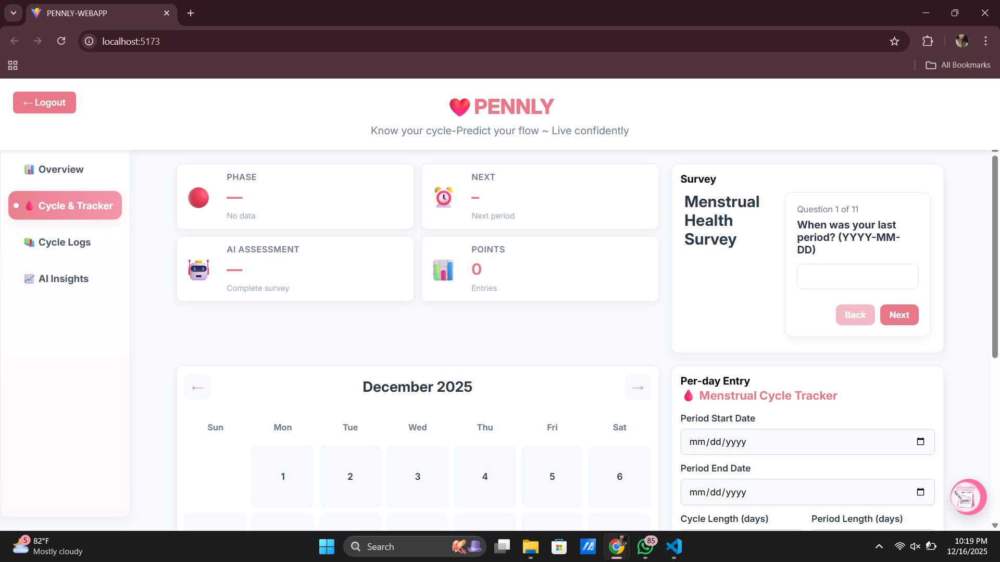
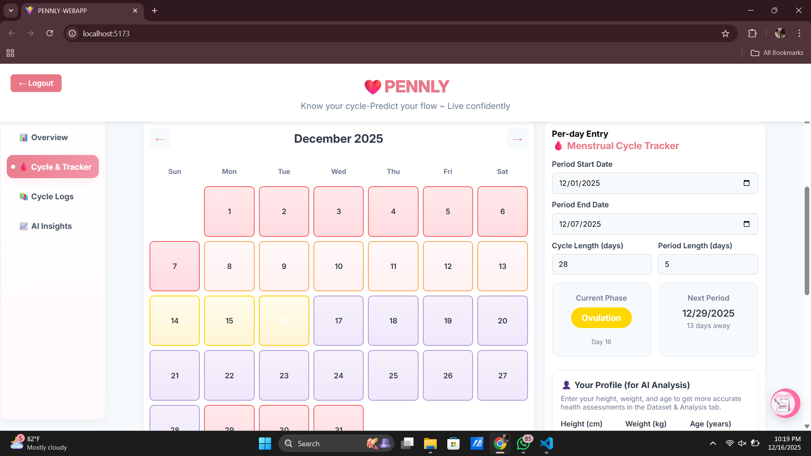
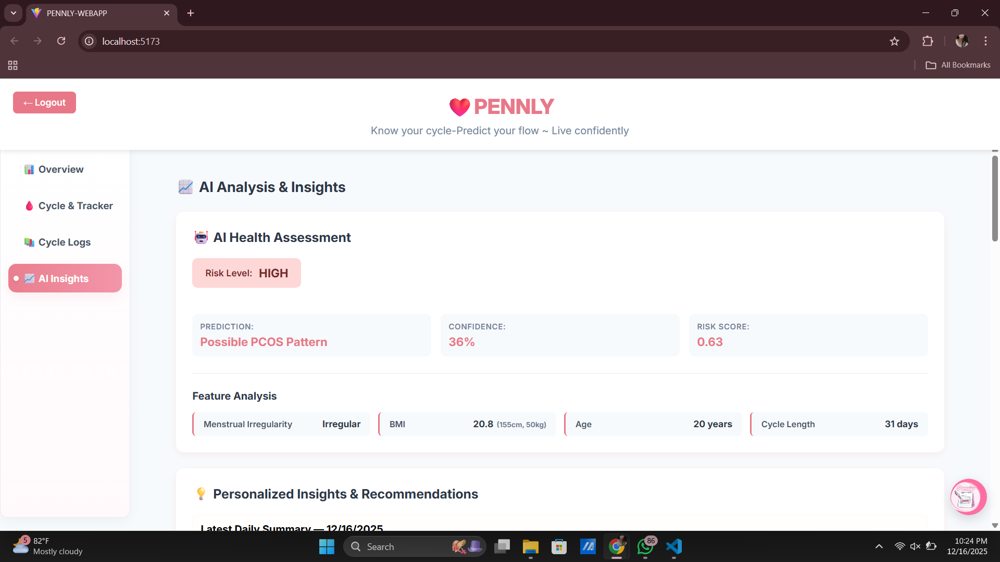
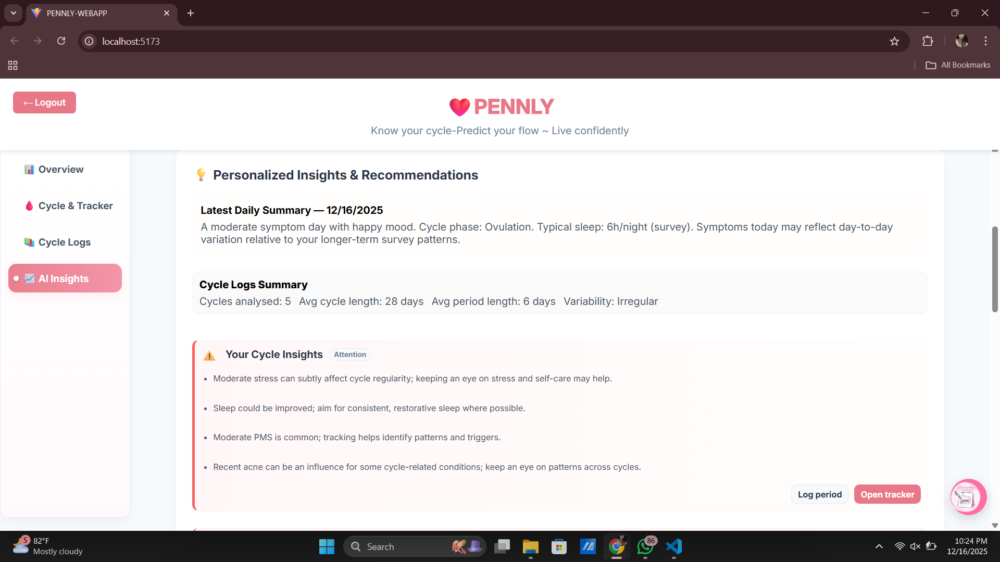
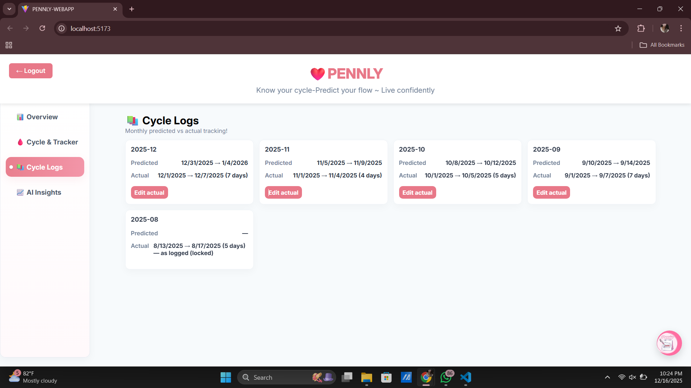
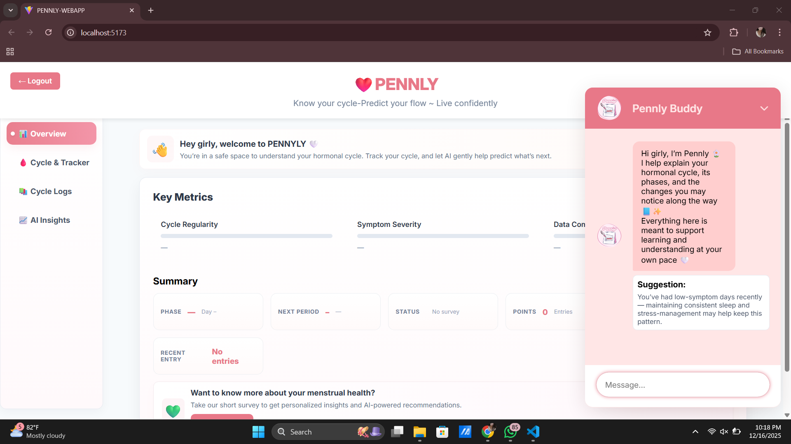
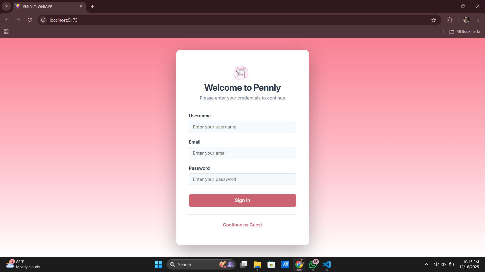

# 💖 PENNILY: Your Magical Menstrual Companion 🌸 <3

Welcome to **PENNILY**, the sweetest way to track your menstrual cycle! 🌟 This adorable React app helps you log periods, predict cycles, visualize data with cute charts, and chat with an AI-powered chatbot for all your cycle questions. It's like having a bestie in your pocket! 🦄✨

## 🌈 Features

- **Period Tracker**: Log your cycles, symptoms, and moods with ease. 📅💕  
  
- **Cycle Visualizations**: See your data in pretty charts powered by Recharts. 📊🌺  
  
- **AI Chatbot**: Ask questions and get personalized advice from our Gemini-powered friend! 🤖💬  
  
- **PCOS Predictions**: Get insights on potential PCOS patterns using smart ML. 🔮💖  
  
- **Surveys & Logs**: Fill out fun surveys and keep monthly logs. 📝🧸  
  
- **Dashboard**: A cozy dashboard to view all your cycle magic. 🏠🌸  
  
AI Insights. 🏠🌸  
  

All data is stored locally in your browser for privacy—no backends, just pure cuteness! 🔒 

##  Getting Started

### Prerequisites
- Node.js (v18 or higher) 
- Docker (for containerized deployment) 

### Installation

1. **Clone the repo** (if not already):
   ```
   git clone -b Mandy <your-repo-url>
   cd AI
   ```

2. **Install dependencies**:
   ```
   npm install
   ```

3. **Set up your API key**:
   - Copy .env.example to .env (if available) or edit .env.
   - Add your Gemini API key from Google AI Developers

4. **Run locally**:
   ```
   npm run dev
   ```
   Open `http://localhost:5173` and start tracking! 🎉

### Docker Deployment (Super Easy!)

1. **Build the image**:
   ```
   docker build -t pennyly-app .
   ```

2. **Run the container**:
   ```
   docker run -d -p 8080:80 --name pennyly pennyly-app
   ```

3. **Access your app**:
   Visit `http://localhost:8080` for the full experience! 🌐💕

For Kubernetes, check out `k8s-deployment.yml` for cloud deployment. ☁️ 

## 🎀 Usage

- **Landing Page**: Start here for an intro to your cycle journey. 🏁  
  
- **Dashboard**: View summaries, charts, and predictions. 📈
- **Tracker**: Log your periods and symptoms. 📓
- **Logs**: Review monthly data. 📖
- **Survey**: Answer questions for better insights. ❓
- **Chatbot**: Type away for cycle advice! 💬

Remember, this is client-side only—your data stays with you! 🔐 


## 🤝 Contributing

Want to add more cuteness? Fork the repo, make your changes, and submit a PR! We love contributions that make PENNYLY even more fabulous. 💃 

## 📜 License

This project is licensed under the MIT License—share the love! ❤️

---

Made with 💖 by the PENNILY team (Cicak-Cicak Group). Happy tracking, queens! 👑🌟
